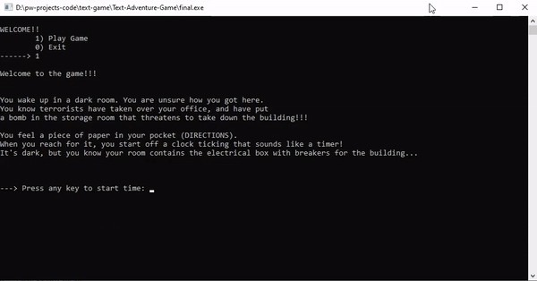

# room-game-project

# Demo

This project was to practice using pointers and classes/OOP in C++.

Requirements:

Implement a game where the user must travel between "rooms" or "spaces", collecting "items" to be used at the end to accomplish some "goal" for the game. The user must interact with the rooms along the way (ex. open doors, turn on lights, fight monster) not just occupy them and leave. There must be a time limit for the game that prevents it from going on forever if the user does not engage or takes too long to finish. There must be a "container" to put the items picked up in the rooms.

There must be at least six rooms, with each room having at least four pointers that lead to another room. At least two of the pointers must be used, preferably all four.
